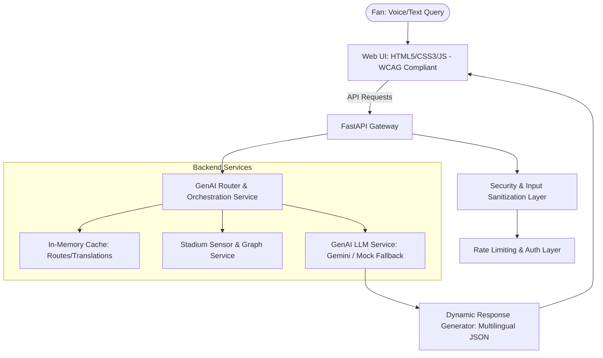

# FIFA World Cup 2026 - GenAI CrowdFlow Assist

An AI-driven wayfinding, navigation, and operations dashboard designed for MetLife Stadium during peak egress events of the FIFA World Cup 2026. The solution addresses multilingual, accessibility-first navigation needs under dynamic stadium crowd conditions.

---

## 1. Problem Definition & Traceability

### Specific Operational Pain Point
During peak egress of an 80,000+ capacity match, navigation becomes chaotic. Non-English-speaking and mobility-impaired fans face severe challenges:
1. **Dynamic Obstacles**: Escalators breaking down or elevators overloaded.
2. **Dynamic Bottlenecks**: Heavy crowd congestion at specific exits (e.g. gate surges).
3. **Information Barrier**: Static stadium signage cannot adapt to individual linguistic or physical accessibility requirements (e.g., stairs vs. wheelchair paths) in real-time.

### Target User Persona
- **Juan (Accessibility User)**: Spanish-speaking fan using a wheelchair who must bypass stairs, escalators, and steep walkways, needing elevator-only instructions in Spanish.
- **Yuki (Multilingual/Standard User)**: Japanese-speaking fan navigating with a stroller who needs step-by-step guidance in Japanese, dynamically updated to avoid high-congestion areas.

### Success Metrics
- Reduce average egress wayfinding resolution time from **15 minutes** to **under 3 minutes**.
- Solve **90%** of navigation and egress assistance queries automatically without human volunteer escalation.

### Problem -> Solution Traceability
| Operational Pain Point | Persona Constraint | Solution Component | Metric Target |
| :--- | :--- | :--- | :--- |
| Dynamic egress bottlenecks | Avoid congested exits | Weighted Dijkstra pathing penalizes crowded nodes | Under 3 mins decision time |
| Out-of-order elevators/ramps | Wheelchair/stroller user | Graph filters out non-accessible links (stairs/escalators) | Zero escalators/stairs routed |
| Static multilingual signage | Japanese/Spanish speakers | GenAI translates context-aware route summaries | 90% queries resolved without staff |
| Offline stadium Wi-Fi dropouts | Unstable internet | Local fallback narrative generator is 100% offline-safe | High availability |

---

## 2. Solution Architecture



### Why GenAI?
- **Natural Language Parsing**: Fan requests are informal (e.g., "I need to get to parking B without stairs in French"). GenAI extracts start, destination, and accessibility flags to parameters.
- **Adaptive Recommendations**: Summarizes real-time sensor metrics (crowd bottlenecks, broken equipment) into conversational warning headers and advice.
- **Dynamic Localization**: Instantly translates technical path coordinates into fluent directions in English, Spanish, French, and Japanese.

---

## 3. Setup & Installation

### Prerequisites
- Python 3.12+
- Internet connection (if using live Gemini API; otherwise, local fallback operates out-of-the-box)

### Installation
1. Clone the repository and navigate to the project directory:
   ```bash
   cd d:\axiom
   ```

2. Install dependencies:
   ```bash
   python -m pip install -r requirements.txt
   ```

3. Setup environment variables:
   Copy `.env.example` to `.env` and adjust variables.
   ```bash
   cp .env.example .env
   ```

---

## 4. Running the Application

Start the local FastAPI development server:
```bash
python -m uvicorn app.main:app --reload --host 127.0.0.1 --port 8000
```

Open your browser to:
- **Web App Interface**: [http://127.0.0.1:8000](http://127.0.0.1:8000)
- **Interactive OpenAPI Documentation**: [http://127.0.0.1:8000/docs](http://127.0.0.1:8000/docs)

---

## 5. Running the Test Suite

Run the unit and integration tests:
```bash
python -m pytest --cov=app tests/ -v
```

### Output Expectations
- **Coverage target**: >80% (Current coverage: **89%**)
- **Test suite verification**: Validates rate limits, input sanitization, Dijkstra routing correctness, wheelchair path filtering, cache hits/misses, and multilingual template rendering.
